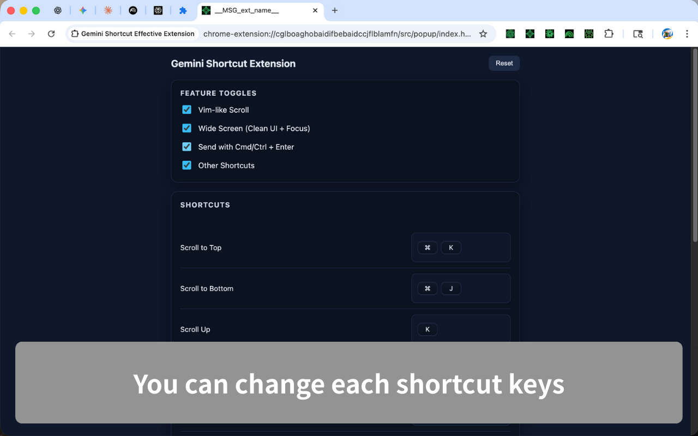

# Gemini Shortcut Effective Extension

[](./LICENSE)

<!-- Add other badges here if desired (CI Status / Version, etc.) -->

- Chrome Web Store: [Gemini Shortcut Effective Extension](https://chromewebstore.google.com/detail/gemini-shortcut-effective/ignpkjaahmegdgnbmnpakehoekaligmm?authuser=0&hl=en)

## Overview

Keyboard-first helpers for Google Gemini: safer send, Vim-style scrolling, model switching, chat tools, and a configurable shortcut popup.  
Built as an open-source Chrome Extension (Manifest V3) with Vite + TypeScript.

---

## Features

- Safe send: require Cmd/Ctrl + Enter to send so Enter adds a newline
- Vim-like scroll and focus toggle (j/k, J/K, Cmd/Ctrl + J/K, Shift + Space)
- Model switching shortcuts for Fast/Thinking/Pro and the model menu
- Chat utilities: pin chat, open temporary chat, delete chat with confirm, toggle sidebar, auto-close sidebar after new chat
- Quick actions: file upload hotkey and shortcuts dialog (Cmd/Ctrl + /) with configurable bindings in the popup

---

## Screenshots

| Screen | Description |
| --- | --- |
|  | 
|  |

---

## Installation

### Chrome Web Store (recommended)

- Chrome Web Store: [Gemini Shortcut Effective Extension](https://chromewebstore.google.com/detail/gemini-shortcut-effective/ignpkjaahmegdgnbmnpakehoekaligmm?authuser=0&hl=en)

### Local install (Developer Mode)

1. Clone the repository

```bash
git clone https://github.com/gakkunn/Ex-Chrome-Gemini.git
cd Ex-Chrome-Gemini
```

### 2. Install dependencies & build

```bash
npm install
npm run dev   # watch build to dist/ for loading as unpacked
# or
npm run build # production bundle
```

### 3. Load into Chrome (Developer Mode)

1. Open Chrome  
2. Go to `chrome://extensions/`  
3. Turn on **Developer mode** in the top right  
4. Click **Load unpacked**  
5. Select the `dist/` folder generated by the build/watch output

---

## Usage

1. After installing the extension, pin the icon from the Chrome toolbar and open the popup.
2. Enable/disable feature toggles and edit shortcuts in the popup (conflicts and Gemini defaults are checked automatically).
3. On `https://gemini.google.com/`, try the defaults:
   - Shift + Space: toggle focus on the chat input
   - Cmd/Ctrl + Enter: send; Enter alone adds a newline (safe send)
   - j / k, Shift + J / Shift + K, Cmd/Ctrl + J / Cmd/Ctrl + K: Vim-like scroll controls
   - Cmd+Shift+0 (macOS) / Ctrl+Shift+7 (Windows): switch to Fast model; Cmd/Ctrl + Shift + 8 / 9: switch to Thinking/Pro; Cmd/Ctrl + Shift + ↓: open model menu
   - Cmd/Ctrl + U: open file upload; Cmd/Ctrl + Shift + Backspace: delete current chat (with confirmation); Cmd/Ctrl + Shift + P to pin chat; Cmd/Ctrl + I to start a temporary chat
   - Cmd/Ctrl + /: open the shortcuts dialog

---

## Development

### Prerequisites

- Node.js: >= 18 (recommended for Vite 7)
- npm

### Setup

```bash
git clone https://github.com/gakkunn/Ex-Chrome-Gemini.git
cd Ex-Chrome-Gemini

npm install
npm run dev   # watch build to dist/
# or npm run build
```

### Test

Automated tests are not available yet. Please verify changes manually in Chrome.

---

## Project Structure

```text
Ex-Chrome-Gemini/
  src/                 # Extension source (background, content, inject, popup, manifest)
  public/              # Icons/static files
  docs/images/         # Screenshots and store assets
  _locales/            # i18n messages
  config/              # Tooling configs
  dist/                # Build artifacts (generated by Vite)
  package.json
  vite.config.ts
  README.md
  LICENSE
```

---

## Contributing

Bug reports, feature suggestions, and pull requests are welcome 🎉  
Please refer to [CONTRIBUTING.md](./CONTRIBUTING.md) for detailed guidelines.

Quick steps:

1. Check Issues; create a new one if it doesn't exist
2. Fork the repository
3. Create a branch (e.g., `feat/xxx`, `fix/yyy`)
4. Commit changes and push
5. Create a Pull Request

---

## Privacy Policy

This extension stores settings (feature toggles and shortcut bindings) locally via Chrome storage and does not send browsing data to external servers. For details, please see our [Privacy Policy](./PRIVACY_POLICY.md).

---

## License

This project is released under the [MIT License](./LICENSE).
